# COMP 488 – Assignment 4  
## Kubernetes RBAC

This assignment covers Kubernetes Role-Based Access Control (RBAC), including ServiceAccounts, Roles, RoleBindings, ClusterRoles, ClusterRoleBindings, and real-world RBAC design.

The README includes:
- Answers to all conceptual questions
- Explanations of my approach
- Screenshots demonstrating testing
- Links/references to YAML files and outputs

---

# Part 1: Understanding the Basics

### Task 1.1 – Inspect Default Service Account

Task 1.1 — Answers
1. List all service accounts in the default namespace

I ran the command kubectl get serviceaccounts -n default
The result showed that there is only **one** ServiceAccount in the `default` namespace:

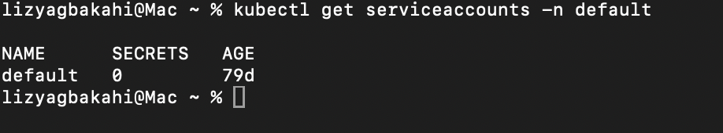

2. Describe the 'default' ServiceAccount and what it can do

Kubernetes automatically created the `default` ServiceAccount at the same time it created the `default` namespace. This happens when the cluster is initialized. Kubernetes always ensures that every namespace contains a `default` ServiceAccount, even if no other resources have been deployed.

From my inspection using `kubectl describe serviceaccount default -n default`, I observed:

- It has **no associated Roles or RoleBindings**
- It does **not** have any long-lived API tokens (expected for Kubernetes 1.24+)
- It has **no permissions** to read, write, create, or delete Kubernetes resources
- It functions as a minimal, least-privilege identity for pods

Because it has no RBAC rules attached, the `default` ServiceAccount **cannot perform any meaningful API operations**. For example, it cannot list pods, create deployments, read ConfigMaps, or delete any resources.

In other words, the default ServiceAccount provides **almost zero access** and is effectively a placeholder until permissions are explicitly granted.

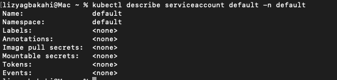

3. Question: Why doesn't the default service account have many permissions?

The default ServiceAccount intentionally has almost no permissions because Kubernetes follows the **Principle of Least Privilege**. If the default ServiceAccount had powerful or broad access, then any pod that forgets to specify a different ServiceAccount would automatically receive those privileges, which would be a major security risk.

By keeping the default ServiceAccount extremely limited, Kubernetes ensures that:

- Pods only get permissions if administrators explicitly grant them  
- A compromised pod cannot interact with critical cluster resources  
- Developers must intentionally bind Roles or ClusterRoles to ServiceAccounts  

This design prevents accidental privilege escalation and keeps the cluster secure by default.

---

### Task 1.2 – Testing Current Permissions

My Kubernetes version does not support the older kubectl run command shown in the prompt, so I used an updated kubectl run with overrides to create the pod using the default ServiceAccount. The test still produced the expected Forbidden error.

After the pod was created, I connected to it using `kubectl exec` and attempted to list pods in the namespace using this command:

kubectl get pods

Kubernetes returned the following error:

Error from server (Forbidden): pods is forbidden: User "system:serviceaccount:default:default" cannot list resource "pods" in API group "" in the namespace "default".

This screenshot shows that the default ServiceAccount cannot list pods, confirming its minimal permissions per Kubernetes RBAC.

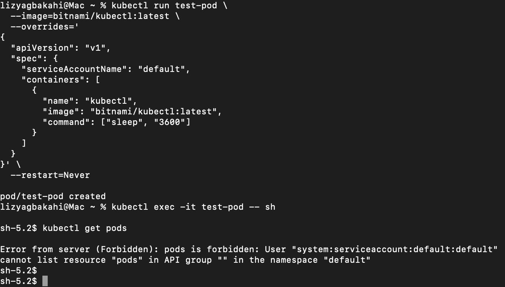

This error occurs because the default ServiceAccount has no Roles or RoleBindings attached to it. Without any RBAC permissions, it is not allowed to perform operations such as listing pods. Kubernetes denies the request because the user identity (system:serviceaccount:default:default) does not have a rule that grants list access on pods.

This behavior is expected and demonstrates the principle of least privilege, which is why the default ServiceAccount starts with almost no permissions.

---

# Part 2: Namespace-Scoped Access (monitoring)

### Goal

Create a ServiceAccount named `monitoring-reader` that can:
- Read Pods, Deployments, and ConfigMaps in the **monitoring namespace**
- Not modify or delete anything

### YAML Resources

- `namespace.yaml`
- `serviceaccount.yaml`
- `role.yaml`
- `rolebinding.yaml`
- `monitoring-test-pod.yaml`

These are located in `part2/`.

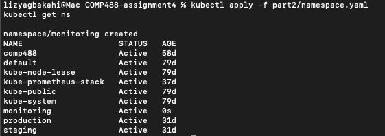

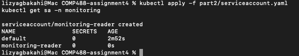

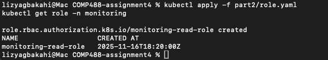

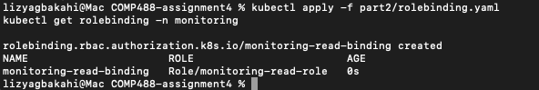

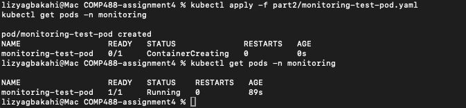

### Testing Allowed Actions

Inside the pod, I tested the read-only permissions by the 'monitoring-read-role'

**Allowed: List pods in the monitoring namespace** 

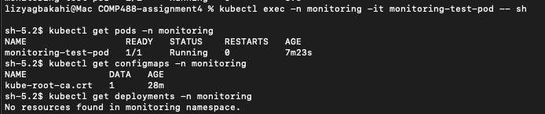

The screenshot above and also the output in my tests.txt file in part 2 folder clearly documents that my ServiceAccount **CAN** read pods, configmaps, and deployments.

**Forbidden: Delete pods in the monitoring namespace**

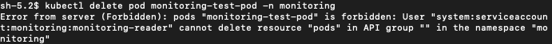

This confirms that monitoring-reader cannot delete or modify resources, which matches the assignment requirements and the principle of least privilege.

These results confirm that the ServiceAccount has **read-only access**.

All YAML files are located in part 2 folder. 
All Test Outputs are in the tests.txt file in part 2 folder. 

# Part 3: Cluster-Wide Access (log-collector)

### Goal

Create a service account for a logging agent that can:
- Read pods in **all namespaces**
- Read nodes
- Not read secrets
- Not modify anything

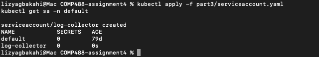

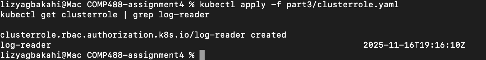

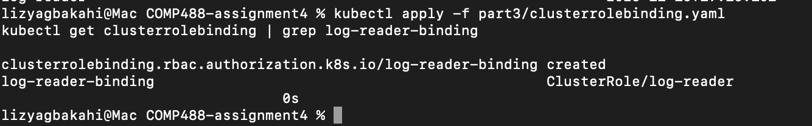

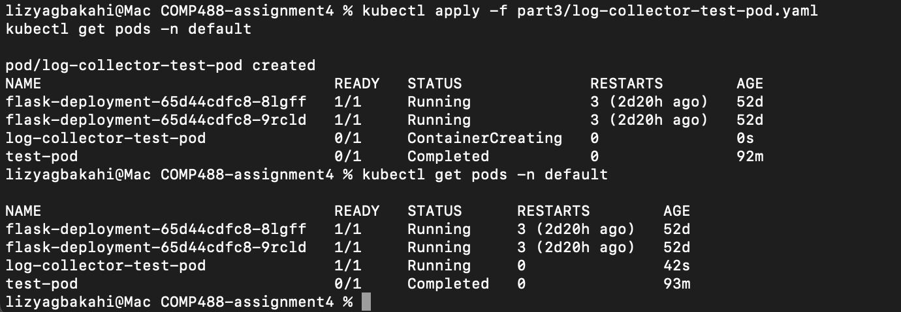

**Testing Allowed Actions** 
Inside the pod I ran:

kubectl get pods -A → worked

kubectl get nodes → worked

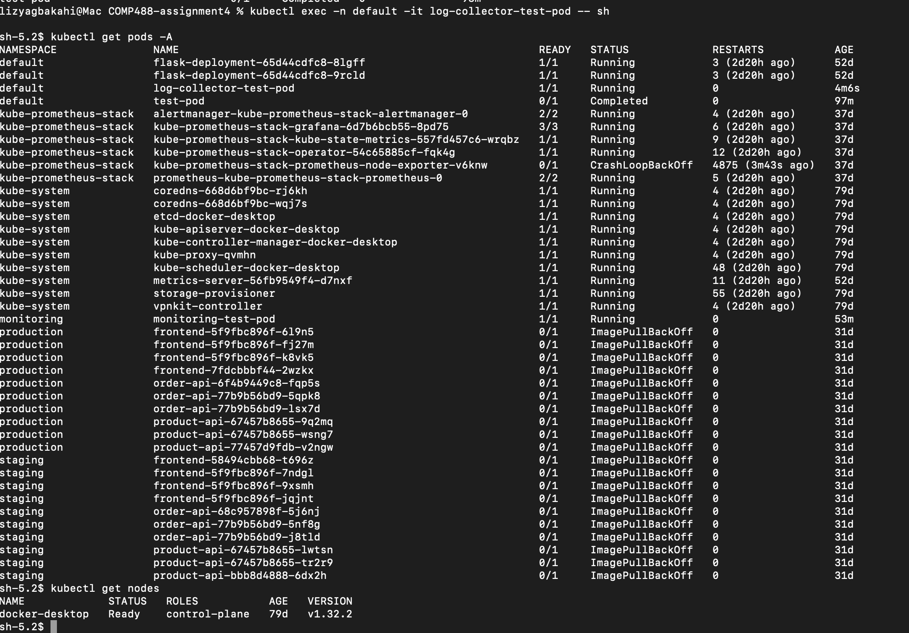

That proves my log-collector ServiceAccount + log-reader ClusterRole + ClusterRoleBinding are all wired correctly.

**Testing Forbidden Actions**
Inside the pod I also ran:

kubectl get secrets -A

Because my ClusterRole only allows pods and nodes, this returned a Forbidden error seen in screenshot above. 

This confirms that the log-collector SA only has the intended read-only cluster-wide permissions and cannot access sensitive data like Secrets

All outputs are seen in tests.txt file in the Part 3 folder
---

# Part 4: Troubleshooting RBAC

Given YAML had multiple errors.  
I fixed the Role, RoleBinding, and namespace mismatch, then tested again.

### Errors Identified
1. **RoleBinding is in the wrong namespace**
   The RoleBinding was created in the `default` namespace, but the Role exists in the `production` namespace. A RoleBinding must be in the same namespace as the Role it references. This caused the RoleBinding to fail because it cannot find a Role named `deployment-role` in the `default` namespace.

2. **Wrong apiGroup for Deployments**
   Deployments are not part of the core API group (represented by `""`). They belong to the `apps` API group. The rule specified `apiGroups: [""]`, which only covers core resources like Pods, Services, and ConfigMaps. This caused all deployment-related operations to be denied because the permissions were granted to a non-existent resource path.

3. **Misaligned namespace scope**
   Even if the RoleBinding were correctly placed in `production`, the original configuration in `default` would have only granted permissions within the `default` namespace (if the Role existed there). Since the ServiceAccount lives in `production` and needs to manage deployments in `production`, both the Role and RoleBinding must be in the `production` namespace.

### Fix Summary
All issues were resolved by:
Placing the RoleBinding in the production namespace
Correcting the API group to "apps" for Deployment resources
Ensuring Role, RoleBinding, and ServiceAccount all exist in the same namespace 

The fixed yaml is located in the fixed.yaml file in the part 4 folder.

---

## Part 5: RBAC Design 

### 5.1 Scenario
For this part, I designed an RBAC model for three teams—Developers, QA, and Ops—working across the `dev`, `staging`, and `production` namespaces. The goal is to follow least privilege and limit each team to only what they need.

---

### 5.2 Developer Team – Write Access in `dev` Only
**ServiceAccount:** `dev-deployer` (in `dev`)

**Role:** `dev-deploy-role` (namespaced)
- Permissions on apps resources:
  - deployments, statefulsets, daemonsets → `get`, `list`, `watch`, `create`, `update`, `patch`, `delete`
- Permissions on core resources:
  - pods, services, configmaps → same verbs

**RoleBinding:** `dev-deploy-binding` → binds role to the ServiceAccount.

**Reasoning:** Developers should only manage resources in `dev`, so a namespaced Role is safer than a ClusterRole.

---

### 5.3 QA Team – Read-Only in `dev` and `staging`
**ServiceAccounts:**  
- `qa-reader` (in `dev`)  
- `qa-reader` (in `staging`)

**ClusterRole:** `qa-readonly`
- Read-only verbs on:
  - pods, services, configmaps
  - deployments, statefulsets, daemonsets

**RoleBindings:**  
- `qa-read-binding-dev`  
- `qa-read-binding-staging`

**Reasoning:** A ClusterRole is used because QA needs the same read-only permissions in both namespaces.

---

### 5.4 Ops Team – Cluster-Wide Read, Write in `production`
**ServiceAccount:** `ops-admin` (in `production`)

**ClusterRole:** `ops-read-all`
- Cluster-wide read access for common Kubernetes resources

**ClusterRoleBinding:** `ops-read-all-binding`

**Role:** `ops-prod-write-role` (in `production`)
- Full write permissions on deployments, pods, services, and configmaps

**RoleBinding:** `ops-prod-write-binding`

**Reasoning:** Splitting global read and production write access keeps Ops limited to modifying only production resources while still seeing the whole cluster.

---

### 5.5 Summary
- Developers: full write access in `dev`
- QA: read-only in `dev` and `staging`
- Ops: read-only cluster-wide, write access in `production`

This design enforces least privilege while supporting each team's workflow.
